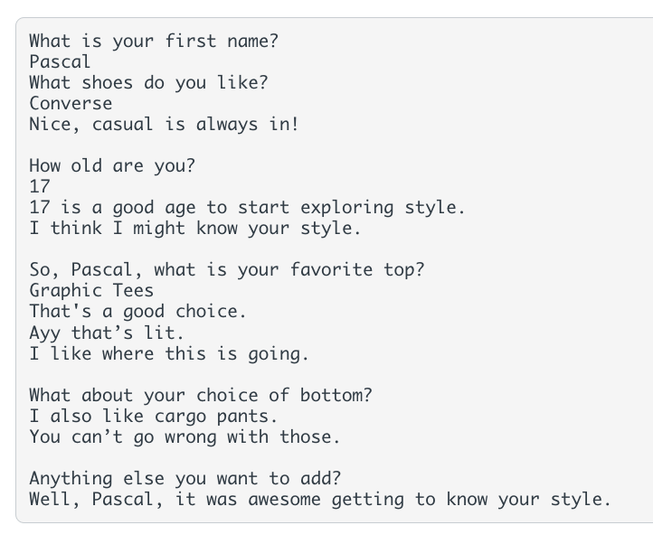

# Instructions  

A chatbot is a computer program designed to emulate human conversation. For this program, you will use if statements, user input, and random numbers to create a basic chatbot.

## The Scenario
You have decided to design a fashion chatbot that helps people pick out their fashion preferences. Your bot can gauge what types of clothes and accessories the user might like.

Your chatbot should ask the user the following (minimum requirements for the grader) and then give answers depending on the answers the user inputs:

- at least 6 questions
- at least 3 if-elif-else statements
- ​​the use of the random module and randomly generated numbers
Based on these criteria, some responses will be based on what the user types and some will be based on random numbers.

# For example, 
- if the chatbot asks what is your favorite head accessory, your chatbot might respond I also think baseball hats are best. in response to a user input of baseball hats, or I love beanies! in response to a user input of beanies.

## Additionally, 
-you could also have a random number generated between, say, 1 and 3 and have a corresponding response depending on the number to randomly answer with That’s in right now. or Wow, so stylish!, and so on.

**_Note_** that in order to pass all of the test cases, your randomly generated numbers should not be dependent on user input (for example, you would not want to include a situation where if the user inputs a specific phrase, then a random number is generated). The randomly generated numbers should prompt a reply from the chatbot, and should do so separately from the user input statements that prompt a reply from the chatbot.

**Sample Run**
Please note that due to the infinite possibility of questions that can be asked, your program will be different—this is only one example.

  